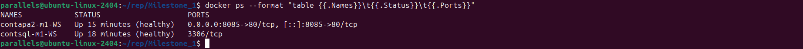
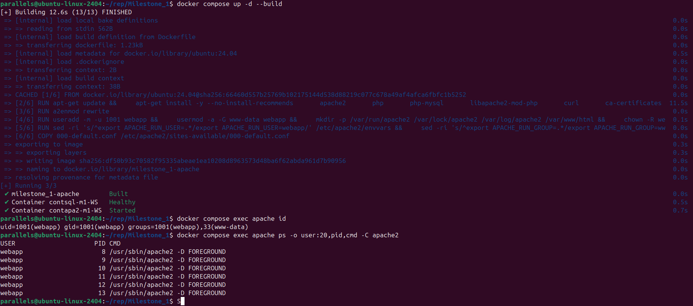
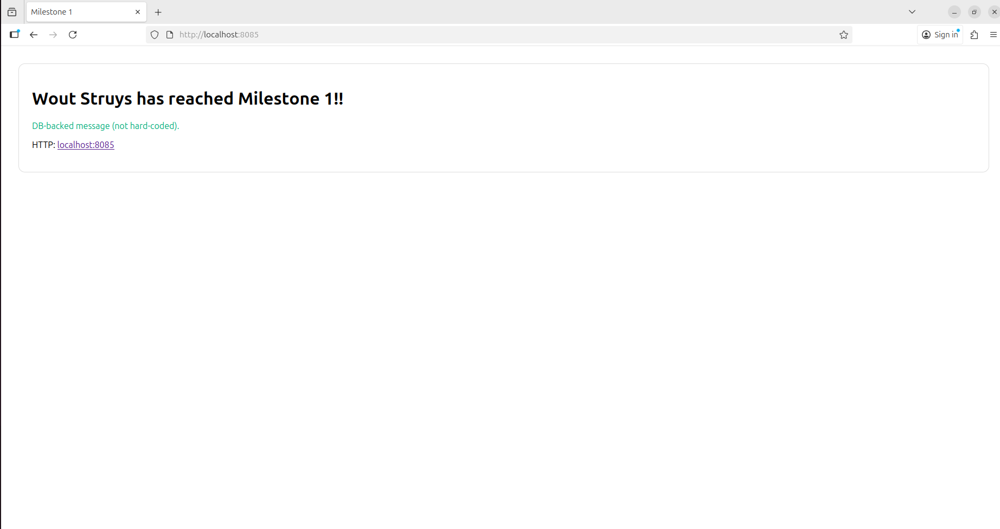
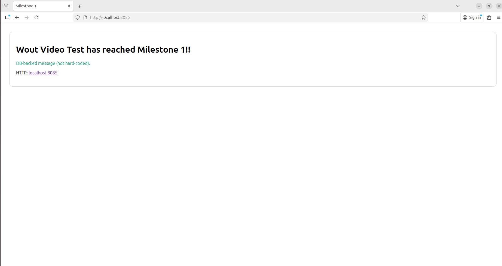

# LAMP Stack (Apache2 + MariaDB) with Docker & Compose

Author: Wout Struys
Date: 2025-10-25
Target: Milestone 1 (baseline + extras)

## 1) Overview

This document shows a clean, reproducible setup of a containerized LAMP stack on Docker using:
- Apache 2 (Ubuntu 24.04 base, custom Dockerfile)
- MariaDB (official image)
- Docker Compose for orchestration
æ
It meets all required deliverables: web page reading a name from the DB, host persistence for web files and database, proof steps (update name → page updates; restart → data persists), and professional documentation with screenshots guidance.

Extras implemented:
- Health checks for both services
- Non‑privileged user running Apache (custom user: webapp)

Container naming follows the spec:
- Apache: `contapa2-m1-WS`
- MariaDB: `contsql-m1-WS`


## 2) Repository Layout
```bash
project-root/
├─ docker-compose.yaml
├─ apache/
│  ├─ Dockerfile
│  └─ 000-default.conf              # HTTP vhost (port 80)
├─ web/                        # Mounted into /var/www/html (persistent)
│  ├─ index.php
│  └─ db.php
├─ db/
│  └─ init.sql                 # Initializes DB + table + 1 record
└─ data/
   └─ mysql/                   # Host bind mount for MariaDB data dir (persistent)
```

## 3) Docker Compose

File: `docker-compose.yaml`
```yaml
services:
  apache:
    container_name: contapa2-m1-WS
    cap_add:
      - NET_BIND_SERVICE
    build:
      context: ./apache
    depends_on:
      db:
        condition: service_healthy
    ports:
      - "8085:80"     # HTTP
    environment:
      DB_HOST: contsql-m1-WS
      DB_NAME: milestone
      DB_USER: appuser
      DB_PASSWORD: apppass
    volumes:
      - ./web:/var/www/html
    healthcheck:
      # Check PHP + Apache + DB connectivity via a lightweight endpoint
      test: ["CMD", "curl", "-fsS", "http://localhost"]
      interval: 10s
      timeout: 3s
      retries: 3
      start_period: 20s

  db:
    container_name: contsql-m1-WS
    image: mariadb:11.4
    environment:
      MARIADB_ROOT_PASSWORD: rootpass
      MARIADB_DATABASE: milestone
      MARIADB_USER: appuser
      MARIADB_PASSWORD: apppass
    volumes:
      - ./data/mysql:/var/lib/mysql
      - ./db/init.sql:/docker-entrypoint-initdb.d/01-init.sql:ro
    healthcheck:
      # MariaDB official images provide healthcheck.sh
      test: ["CMD", "healthcheck.sh", "--su-mysql", "--connect", "--innodb_initialized"]
      interval: 10s
      timeout: 5s
      retries: 5
````

Explanation of key options
- `container_name`: matches the exact naming requirement.
- `depends_on.condition`: service_healthy: waits until DB is healthy before starting Apache.
- `ports`: exposes HTTP 8085.
- `environment`: passes DB connection vars to PHP.
- `volumes`: ensures web files and DB data persist on the host.
- `healthcheck` (Apache): probes http://localhost inside the container.
- `healthcheck` (MariaDB): uses the built‑in script to verify the DB is ready.

## 4) Apache Dockerfile (Ubuntu 24.04, non‑root, HTTPS)

File: `apache/Dockerfile`
```Dockerfile
FROM ubuntu:24.04

ARG DEBIAN_FRONTEND=noninteractive

# Install Apache, PHP, and required tools
RUN apt-get update && \
    apt-get install -y --no-install-recommends \
      apache2 \
      php \
      php-mysql \
      libapache2-mod-php \
      curl \
      ca-certificates && \
    rm -rf /var/lib/apt/lists/*

# Enable needed Apache modules (no SSL)
RUN a2enmod rewrite

# Create non-root user and set permissions
# - UID 1001 for webapp
# - Add to www-data group
# - Ensure Apache runtime and web dirs are writable
RUN useradd -m -u 1001 webapp && \
    usermod -a -G www-data webapp && \
    mkdir -p /var/run/apache2 /var/lock/apache2 /var/log/apache2 /var/www/html && \
    chown -R webapp:www-data /var/run/apache2 /var/lock/apache2 /var/log/apache2 /var/www/html

# Make Apache drop privileges to webapp
RUN sed -ri 's/^export APACHE_RUN_USER=.*/export APACHE_RUN_USER=webapp/' /etc/apache2/envvars && \
    sed -ri 's/^export APACHE_RUN_GROUP=.*/export APACHE_RUN_GROUP=www-data/' /etc/apache2/envvars

# Site config
COPY 000-default.conf /etc/apache2/sites-available/000-default.conf

EXPOSE 80

# Run as non-root
USER webapp

# Start Apache
CMD ["apache2ctl", "-D", "FOREGROUND"]
```

### Why this is secure/best practice

- Non‑root: Apache processes run as webapp with limited privileges.
- Modules: Only necessary modules enabled (PHP, SSL, rewrite).
- Permissions: webapp:www-data with 775 to allow Apache to read/write as needed.


## 5) Apache VirtualHost configs

File: apache/apache.conf (HTTP on 80)
```ApacheConf
<VirtualHost *:80>
    ServerAdmin webmaster@localhost
    DocumentRoot /var/www/html

    <Directory /var/www/html>
        AllowOverride All
        Require all granted
    </Directory>

    ErrorLog ${APACHE_LOG_DIR}/error.log
    CustomLog ${APACHE_LOG_DIR}/access.log combined
</VirtualHost>
```

## 7) PHP app (reads name from DB)

File: web/db.php
```php
<?php
$host = getenv('DB_HOST') ?: 'contsql-m1-WS';
$db   = getenv('DB_NAME') ?: 'milestone';
$user = getenv('DB_USER') ?: 'appuser';
$pass = getenv('DB_PASSWORD') ?: 'apppass';

$mysqli = @new mysqli($host, $user, $pass, $db);
if ($mysqli->connect_errno) {
    http_response_code(500);
    die("DB connection failed: " . $mysqli->connect_error);
}
```
File: web/index.php
```php
<?php
require __DIR__ . '/db.php';
$result = $mysqli->query("SELECT full_name FROM student LIMIT 1");
$row = $result ? $result->fetch_assoc() : null;
$name = $row ? $row['full_name'] : 'Unknown Student';
?>
<!doctype html>
<html lang="en">
<head>
  <meta charset="utf-8">
  <meta name="viewport" content="width=device-width, initial-scale=1">
  <title>Milestone 1</title>
  <style>
    body { font-family: system-ui, sans-serif; margin: 2rem; }
    .box { padding: 1.5rem; border: 1px solid #ddd; border-radius: 12px; }
    .ok { color: #0a7; }
  </style>
</head>
<body>
  <div class="box">
    <h1><?php echo htmlspecialchars($name); ?> has reached Milestone 1!!</h1>
    <p class="ok">DB‑backed message (not hard‑coded).</p>
    <p>
      HTTP: <a href="http://localhost:8085/">localhost:8085</a> |
      HTTPS: <a href="https://localhost:8443/">localhost:8443</a> (self‑signed; accept warning)
    </p>
  </div>
</body>
</html>
```

## 8) Database init script

File: db/init.sql
```sql
CREATE TABLE IF NOT EXISTS student (
  id INT PRIMARY KEY AUTO_INCREMENT,
  full_name VARCHAR(255) NOT NULL
);

INSERT INTO student (full_name) VALUES ('Wout Struys');
```

## 9) Build & Run

### One-time setup
```bash
# From project root
mkdir -p data/mysql web certs

# Build and start
docker compose up -d --build

# Check status (health should become healthy)
docker ps --format "table {{.Names}}\t{{.Status}}\t{{.Ports}}"
```

### Show ports mapping



### Visit the site
- HTTP: http://localhost:8085

### Verify non‑privileged user (proof)
```bash
docker compose exec apache id
# uid=10001(webapp) gid=33(www-data) groups=33(www-data)

docker compose exec apache bash -lc 'ps -o user:20,pid,cmd -C apache2'
# USER                 PID CMD
# webapp              <pid> /usr/sbin/apache2 -D FOREGROUND
# ... (children as webapp)
```

### User running Apache: `webapp` (uid 1001)


## 10) Proof Steps (for ≤ 1‑minute video)

### A) Change name in DB → refresh page shows change
```bash
# Enter DB shell
docker exec -it contsql-m1-WS mariadb -uroot -prootpass milestone -e "UPDATE student SET full_name='Wout Video Test' WHERE id=1;"
# Now refresh http://localhost:8085 → text updates immediately
```
### B) Remove & restart the stack → data persists

```bash
# Stop and remove containers (data on host persists)
docker compose down

# Start again
docker compose up -d

# Refresh the page → should still show "Wout Video Test"
```

### Webpage with name from DB


### Webpage after restart (data persists)


### Video is in `Milestone_1_Proof.mov` - [Video On Youtube](https://youtu.be/FUvehWBO4pg)

## 11) Generative AI (Prompts & Responses) & Reflection

Prompts are in `AI_Prompt.md` or `AI_Prompt.pdf`.

I use ChatGPT to get the draft you see in the AI_Prompt.md file. I made some changes and corrections to the README.md. The code itself was mostly accurate from the start, I only removed the part about encrypted HTTPS as I could not get it to work. I also need to debug some thing in my environment because i had some specieke to me because i use a ubuntu on parallels on my mac.

## 12) Conclusion

You now have a fully containerized LAMP stack that:
- Serves a PHP page on 8085 that reads from MariaDB.
- Stores web content and database data on the host (persistence proven across restarts).
- Implements health checks, non‑root execution.
